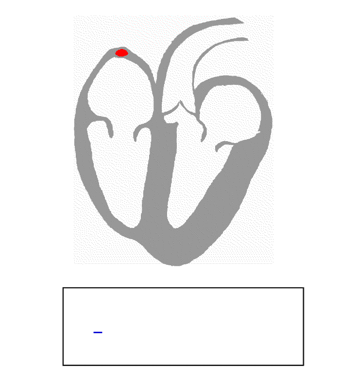
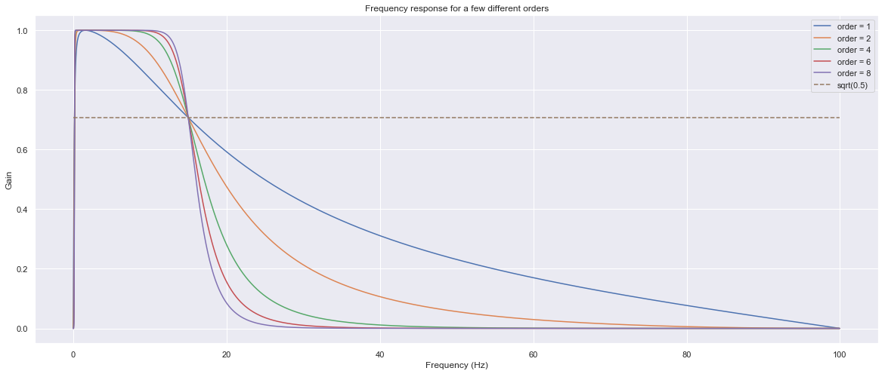

# ECG ANALYSIS

## Motivation
ECG is a type of time-series data, it has its own particular properties.
This project is created to learn these specifics and how to obtain valuable features from the ECG signal. In particular, from QRS complexes, RR intervals.

## QRS complex
Visualization:

## Screenshots

Raw signal:

Filter frequency response:

Applied filter:

R peaks detection process:

Comparison with different R-peaks detecors:

## Dependencies
  - : `conda install nb_conda`
  - : `conda install matplotlib`
  - : `conda install seaborn`
  - : `conda install numpy`
  - : `conda install pywavelets`
  - : `conda install scipy`
  - : `pip install biosppy`
  - : `pip install pyhrv`

## Literature:
1.  Pan-Tomkins algorithm (Pan J., Tompkins W. J., A real-time QRS detection algorithm, IEEE Transactions on Biomedical Engineering, Vol. BME-32, No. 3, March 1985, pp. 230-236).
2. [ECGwaves.com](https://ecgwaves.com/ecg-normal-p-wave-qrs-complex-st-segment-t-wave-j-point/)
3. "ECG filtering T-61.181" – Biomedical Signal Processing Presentation 11.11.2004 Matti Aksela (Aalto University)
4.  "Mining the ECG: Algorithms and Applications" - 2015 KU Leuven – Faculty of Engineering Science Carolina Varon
5. https://imotions.com/blog/heart-rate-variability/
6. http://www.medteq.info/med/ECGFilters
7. http://www.ems12lead.com/2014/03/10/understanding-ecg-filtering/
8. [Band-pass filter | Wikipedia](https://en.wikipedia.org/wiki/Butterworth_filter)
9. [Butterworth filter | Wikipedia](https://en.wikipedia.org/wiki/Butterworth_filter)
10. [Heart rate variability (HRV) | Wikipedia](https://en.wikipedia.org/wiki/Heart_rate_variability)
11. [Electrocardiography | Wikipedia](https://en.wikipedia.org/wiki/Electrocardiography)
12.   Bioelectromagnetism. 19. The Basis of ECG Diagnosis 1995 by Jaakko Malmivuo, Robert Plonsey
13. [Exploring Heart Rate Variability using Python](https://blog.orikami.nl/exploring-heart-rate-variability-using-python-483a7037c64d)
14.  Heart rate variability as an index of regulated emotional responding (Appelhans, Bradley M.,Luecken, Linda J.
Review of General Psychology, Vol 10(3), Sep 2006, 229-240)
